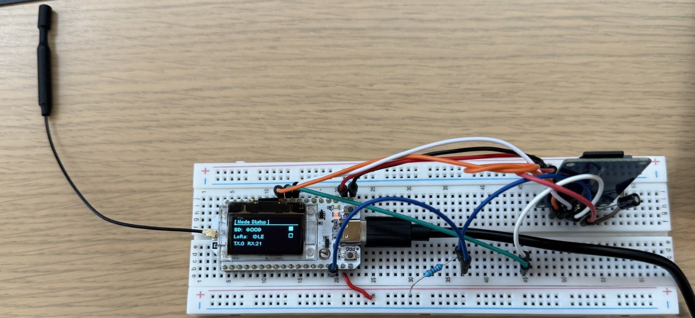
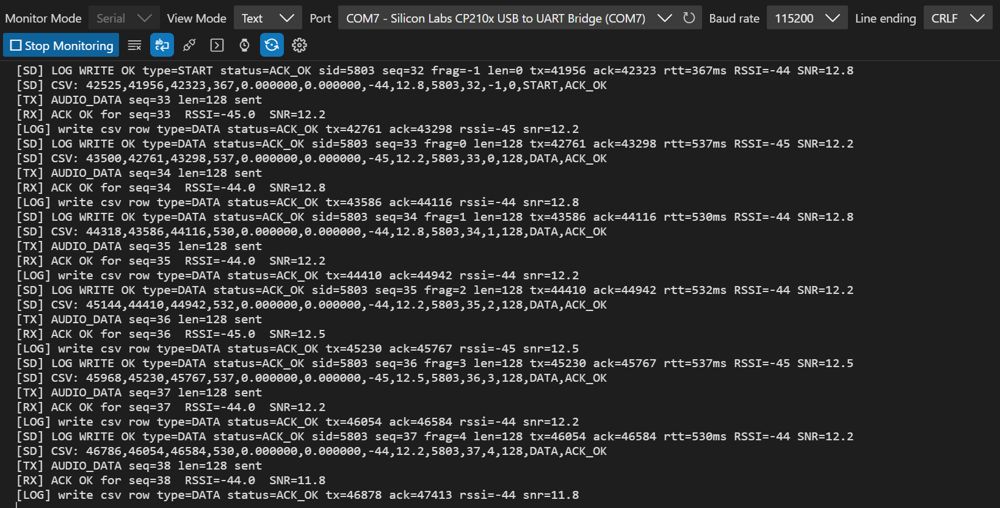

<!-- _class: lead -->

# LoRa 

**Nate Brewer**

---

# Problem Domain

- LoRa(Long Range) has a low bandwidth capacity, which allows for long range, but small payloads. Cannot send large files effectively. 

---

# Proposed Solution

## Proposed Solution

- Understand the **limitations** of **LoRa** in **multiple** different **network settings**.
- Create a extendable P2P network to transfer files effectively 

---

# Architecture

## System Overview pt. 1

**Physical Components:**
- **ESP32 Micro Controller**: **Brains** and main component running software 
- **SD Card Reader** - for storage of transmission objects and logging
- **GPS/GNSS** - Accurate logging position
- **LoRa Tx/Rx**: Transmission and reception devices

---
## System Overview pt. 2
**Tech Stack:**
- **VsCode Arduino Maker Workshop**: Organize, compile and upload software
- **Copilot - ChatGPT - Claude** - Questions, MVP
- **C++** - Code design
- **Github** - VCS

---

# Sprint 1

## Goals
- Simple **LoRa P2P network**
- Understand LoRa's **Spreading Factor** and **Bandwidth**
  
## Tasks
1. Understand how to make a **simple LoRa network** with **complete payload reception** and **transmission**
2. Push it to it's limits - **understand** the **limitations** of the devices (Bandwidth, range)
3. Create **evaluation matrix** for **combinations** of **Spreading factor and bandwidth**. 

---

# Sprint 2

## Goals
- Update to state machine for further testing
- Add GPS/GNSS
- Finish Paper

## Tasks
1. Create a better more extenadable implementation of the device for further testing
2. Add GPS/GNSS for 
3. Write and submit paper with results
    

---

# Images - 

---

# Images 2 - 

---

# Learning with AI

## AI Integration 1

1. C++ is a highly optimizable language perfect for embedded system's programming. It can be useful but also tricky(especially to native Java users) with it's pointers, Structs, STD lib, and memory management just to name a few.

---

## AI Integration 2

2. There a couple over-arching methods of digital communication. Serial and Parallel. Serial is the most common is this day and age due to the speed of cable comms. It has a bunch of protocols that fall under it such as SPI, I2C, UART, and USB to name a few. Wireless is predominantly in serial but is more defined at the transport layer with things lke Bluetooth, WiFi, LoRa, 433 Mhz to name a few.  

---

## How I used AI for coding

- Think about AGILE structure and being a mnager. AI is my subordinate
  - Create features and requirements and self document all. Send to AI, confirm all progress makes sense
  - Rinse and repeat
  - When in a good place, have AI create an integration plan and review, rinse and repeat **WITH SELF REVIEW** 
  - Then have AI follow the plan and test along the way

---

# Paper

[link](https://github.com/brewern5/LoRa-Research/blob/main/docs/paper/paper.pdf)
---

# Future 

- Bit off more than I can chew with mesh network implementation
  - I have the  framework and extension ready to continue but other work got in the way
- Continue testing and write another paper using mesh and 

---

<!-- _class: lead -->

# Questions?

Thank you for your attention!
